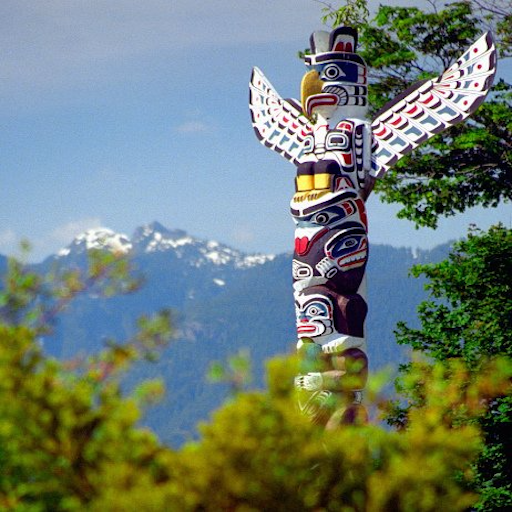
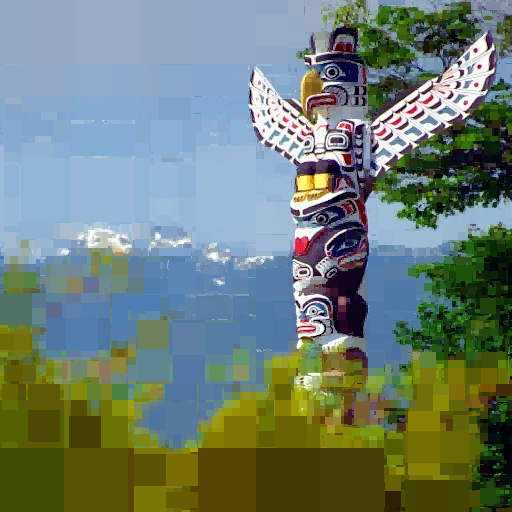
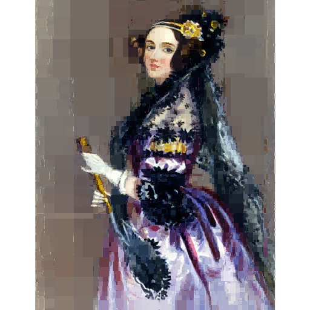
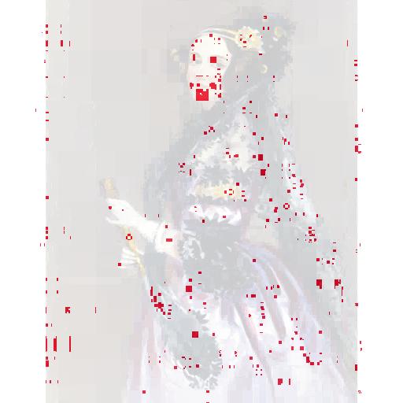

# quadtree-compression
This repository contains the result of a coding assignment completed for UBC's CPSC 221 course.

The original assignment required us to write the code for a quadtree compression algorithm as described [here](https://www.ugrad.cs.ubc.ca/~cs221/2018W2/mps/p3/). The basic idea is to render areas of lower frequencies as constant blocks and thereby compress a given image:

 

Despite its origin as homework, I have decided to upload it, since it allows for a lot of insight into my current coding skills. I think, the code shows very well, that:
- I can work on a large-scale project by myself 
- I am able to break the high-level goal up into many small steps
- My code is legible and well-commented (very important to me)

Provided with the algorithm's logic, images of its desired outcome, and a bare-bone skeleton code, I put myself to work. As suggested by the instructions, I first had to come up with a clever method to compute the _statistics_ necessary for the compilation of a so-called _toqutree_ (torus-quadtree). In a second step, I had to apply the statistics in order to convert an input image recursively into a quadtree structure. Accordingly, my main contribution can be found in the following files:
- `stats.h` and `stats.cpp`
- `toqutree.h` and `toqutree.cpp`

(As a note to the attentive observer, my coding obviously got better over the course of writing these files. While `stats.cpp` contains a few long functions with many lines, `toqutree.cpp` is more readable thanks to the increased use of helper functions.)

In order to validate my code, I've written numerous test-cases of increasing fidelity. They can be found (partly commented-out) in `testComp.cpp`.

The resulting compression met all the course's requirement and got the full score. As an example, we were provided with an image that had been rendered by the instructor's algorithm (below on the left). The comparison to my result (below on the right) shows very little deviation, that can only be explained by differences in the order of 2D-traversals of pixels.

   

In order to use the code, alter the relevant lines in `testComp.cpp` (if you choose an input image of different dimensions, don't forget to set the parameter `k` in `toqutree t1(img, k)` to `min(log_2(width), log_2(height))`.) Compile with `make all` and run with `./pa3test`.
